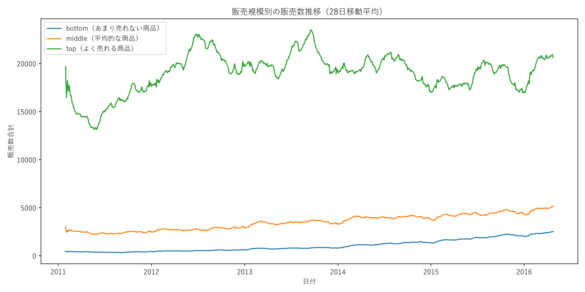
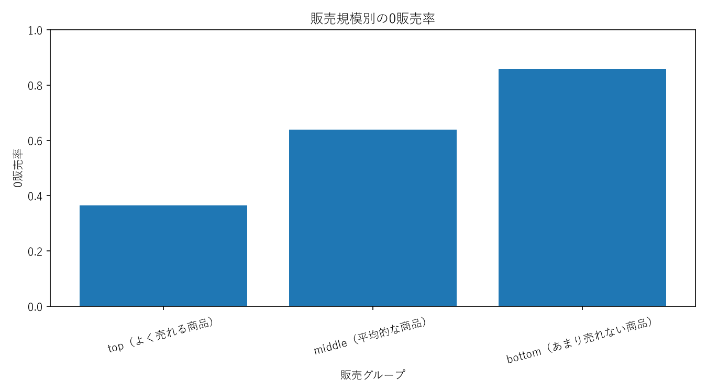
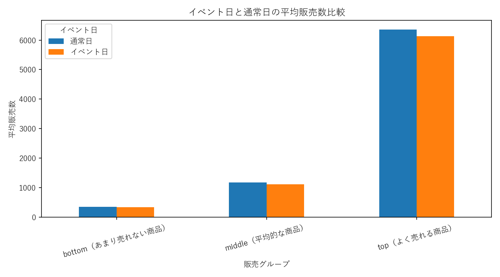
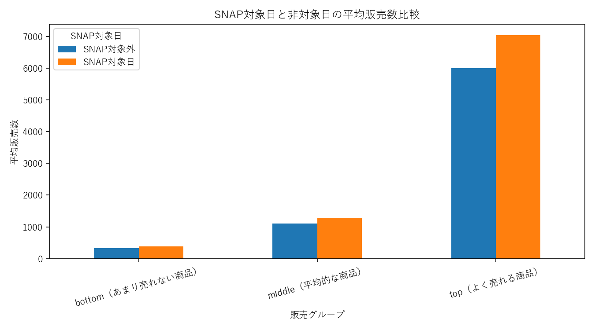
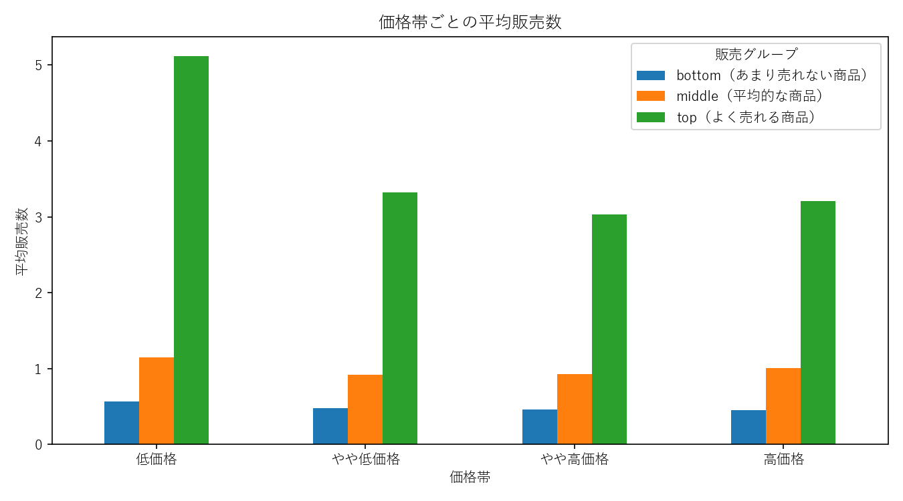
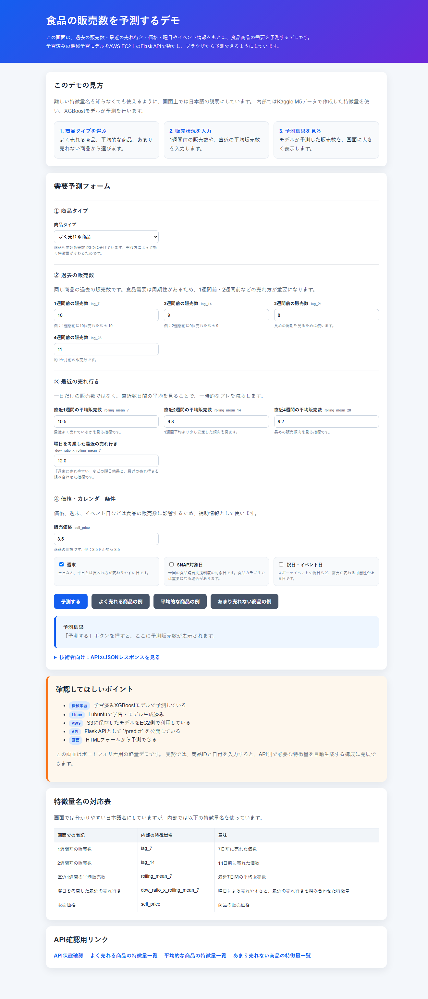
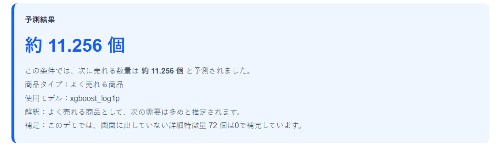

# M5 FOODS Demand Forecasting

Kaggleの **M5 Forecasting Accuracy** データセットを用いて、FOODSカテゴリ商品の需要を予測する機械学習ポートフォリオです。

販売規模の異なる商品を `top` / `middle` / `bottom` に分け、時系列評価、特徴量のAblation Study、目的変数・目的関数の比較を行いました。分析だけで終わらせず、Flask API、HTMLデモ、AWS EC2での常時稼働まで実装しています。

---

## 30秒で分かる概要

| 項目 | 内容 |
| --- | --- |
| 目的 | 販売規模による需要予測の難易度と、有効な特徴量の違いを検証する |
| 対象 | M5データのFOODSカテゴリから、販売規模別に各30商品・合計90商品 |
| 系列数 | 90商品 × 10店舗 = 900系列 |
| モデル | XGBoost Regressor |
| 評価 | 時系列ホールドアウト、4時点のwalk-forward、MAE・RMSE・MAE ratio |
| 比較 | 単純予測、4種類の特徴量セット、squarederror・log1p・Poisson |
| 実装範囲 | EDA、特徴量設計、学習・評価、モデル保存、Flask API、HTML、AWS EC2/S3 |
| 主な結果 | 最良ベースライン比で、MAEを約6〜13%改善 |
| 公開形態 | GitHubでコード・結果を管理し、モデルはS3、APIはEC2で稼働 |

### 主な成果

- `shift(1)`を使ったlag・rolling特徴量で、予測対象日の販売数混入を防止
- 商品選定には最初の評価開始日より前の履歴だけを使用
- 商品選定ロジックを共通モジュール化し、単体テストを追加
- 特徴量を段階的に追加し、各グループで性能変化を比較
- squarederror・log1p・Poissonを同一ホールドアウトで比較
- 1回の分割だけでなく、4時点のwalk-forwardで安定性を確認
- Flask APIとHTMLデモを作成し、AWS EC2でsystemdサービスとして稼働

---

## 予測結果

### 最終モデルの選定

3方式を同じホールドアウト期間で比較し、**MAEを主指標**として最終モデルを選定しました。

<!-- MODEL_SELECTION_RESULT_START -->
3方式を同じホールドアウト期間で比較し、MAEを主指標として選定した結果です。

| グループ | MAE最小モデル | MAE | RMSE | MAE ratio |
| --- | --- | --- | --- | --- |
| bottom | XGBoost_log1p | 0.4583 | 0.8217 | 1.1037 |
| middle | XGBoost_log1p | 0.8087 | 1.2756 | 0.8763 |
| top | XGBoost_log1p | 5.1614 | 8.9268 | 0.3239 |
<!-- MODEL_SELECTION_RESULT_END -->

### 全モデル比較

<!-- FINAL_RESULTS_TABLE_START -->
| グループ | モデル | MAE | RMSE | 平均販売数 | MAE ratio |
| --- | --- | --- | --- | --- | --- |
| bottom | XGBoost_log1p | 0.4583 | 0.8217 | 0.4152 | 1.1037 |
| bottom | XGBoost_poisson | 0.4846 | 0.7998 | 0.4152 | 1.1671 |
| bottom | XGBoost_squarederror_v4 | 0.4898 | 0.7967 | 0.4152 | 1.1795 |
| middle | XGBoost_log1p | 0.8087 | 1.2756 | 0.9229 | 0.8763 |
| middle | XGBoost_poisson | 0.8482 | 1.2491 | 0.9229 | 0.9190 |
| middle | XGBoost_squarederror_v4 | 0.8523 | 1.2539 | 0.9229 | 0.9235 |
| top | XGBoost_log1p | 5.1614 | 8.9268 | 15.9342 | 0.3239 |
| top | XGBoost_poisson | 5.2405 | 8.4990 | 15.9342 | 0.3289 |
| top | XGBoost_squarederror_v4 | 5.2561 | 8.4724 | 15.9342 | 0.3299 |
<!-- FINAL_RESULTS_TABLE_END -->

### 結果の解釈

<!-- RESULT_INTERPRETATION_START -->
* `top`: MAE 5.1614、平均販売数に対するMAE ratioは 0.3239 でした。
* `middle`: MAE 0.8087、平均販売数に対するMAE ratioは 0.8763 でした。
* `bottom`: MAE 0.4583、平均販売数に対するMAE ratioは 1.1037 でした。
絶対誤差だけでなくMAE ratioも併用することで、販売規模が異なるグループ間の予測難易度を比較しています。
<!-- RESULT_INTERPRETATION_END -->

最良の単純予測と比較したMAE改善率は、おおよそ以下です。

| グループ | 最良ベースライン | ベースラインMAE | 最終MAE | 改善率 |
| --- | --- | ---: | ---: | ---: |
| top | 7日移動平均 | 5.9570 | 5.1927 | 約12.8% |
| middle | 28日移動平均 | 1.0006 | 0.9364 | 約6.4% |
| bottom | 7日移動平均 | 0.4265 | 0.3982 | 約6.6% |

改善幅を過大に表現せず、需要規模ごとの予測難易度とモデルの限界も含めて評価しています。

---

## 問題設定と対象商品の選定

食品カテゴリでは、販売量が大きい商品と販売機会の少ない商品で、需要の安定性やゼロ販売日の割合が大きく異なります。

そこで、実務のABC分析の考え方を参考に、商品を販売数量で3層に分けました。

- `top`: 販売量が大きい商品
- `middle`: 販売量が中程度の商品
- `bottom`: 販売量が小さい商品（累計販売数0の商品は除外）

これは在庫金額・売上金額・粗利などの累積構成比を用いる厳密なABC分類ではなく、**需要予測の難易度を比較するための販売数量ベースの層化サンプリング**です。

### 商品数を90商品に限定した理由

M5の全商品・全店舗・全日付を縦持ちへ変換し、多数のlag・rolling特徴量を作ると、ローカルPCのメモリと処理時間への負荷が大きくなります。

そのため、計算資源内で以下を繰り返し検証できる範囲として、各層30商品・合計90商品に限定しました。

- 複数の特徴量セット比較
- 3種類のモデル設定比較
- 4時点のwalk-forward評価
- Business Analysisの再生成

目的はM5コンペ全体の最高スコアではなく、**販売規模による需要特性と予測難易度の違いを検証すること**です。

### 商品選定における未来情報の排除

商品グループは、最初のwalk-forward評価日である **2015-10-01より前の販売履歴だけ**で決定します。

1. 2015-10-01より前の販売数を商品単位で集計
2. `top` / `middle` / `bottom`から各30商品を抽出
3. 選定した商品集合を固定
4. 同じ商品集合で特徴量比較・モデル比較・walk-forwardを実施

評価期間の販売実績は商品選定に使用しません。

選定結果は `results/selected_item_groups.csv` に保存し、NotebookとBusiness Analysisの両方で同じ商品集合を使います。

---

## データリーク対策

時系列データであるため、ランダム分割は使用していません。

### 1. 時系列分割

最終ホールドアウトは以下です。

```text
train: 2016-03-01より前
test : 2016-03-01以降
```

加えて、以下の4時点で学習期間を順次拡張するwalk-forward評価を行いました。

- 2015-10-01
- 2015-12-01
- 2016-02-01
- 2016-03-01

### 2. rolling前のshift

rolling特徴量は、予測対象日の販売数が含まれないように `shift(1)` の後で計算しています。

```python
model_df["rolling_mean_7"] = model_df.groupby("id")["sales"].transform(
    lambda values: values.shift(1).rolling(7).mean()
)
```

### 3. 学習期間だけで作る集計特徴量

曜日効果などの集計特徴量は、テスト期間を含めず、各評価時点の学習期間だけで算出します。

### 4. 商品選定ロジックのテスト

`tests/test_item_grouping.py`では、主に以下を確認しています。

- 評価開始日以降の販売数を変えても、商品選定が変わらない
- 3グループの商品が重複しない
- 選定外の商品が分析対象から除外される

---

## 特徴量

### 販売履歴

| 種類 | 主な特徴量 |
| --- | --- |
| lag | `lag_7`, `lag_14`, `lag_21`, `lag_28` |
| rolling平均 | `rolling_mean_7`, `rolling_mean_14`, `rolling_mean_28` |
| rolling標準偏差 | `rolling_std_7`, `rolling_std_14`, `rolling_std_28` |
| ゼロ販売率 | `zero_rate_7`, `zero_rate_14`, `zero_rate_28` |
| トレンド | 短期平均と長期平均の差・比率 |
| 曜日効果 | 学習期間から算出した曜日別需要比率と交互作用 |

### 外部・属性情報

| 種類 | 主な特徴量 |
| --- | --- |
| カレンダー | 曜日、月、年、月内週、週末 |
| イベント | イベント有無、イベント種別 |
| SNAP | 州ごとのSNAP対象日 |
| 価格 | 販売価格、価格差、価格変化率、値上げ・値下げフラグ |
| 属性 | 部門、店舗、州のone-hot |

---

## 特徴量のAblation Study

特徴量を段階的に追加し、各グループでMAEの変化を確認しました。

| バージョン | 内容 |
| --- | --- |
| `base_lag_rolling` | カレンダー、lag、rolling、zero rate |
| `v2_trend` | baseに短期・長期差分などのトレンド特徴量を追加 |
| `v3_dow_effect` | v2に学習期間から算出した曜日効果と交互作用を追加 |
| `v4_price_event_dept` | v3に価格、イベント、SNAP、店舗・州・部門を追加 |

<!-- FEATURE_SELECTION_RESULT_START -->
特徴量セットごとの比較結果から、各グループでMAEが最小となった構成は以下です。

| グループ | MAE最小の特徴量セット | 特徴量数 | MAE | RMSE | MAE ratio |
| --- | --- | --- | --- | --- | --- |
| bottom | v4_price_event_dept | 48 | 0.4898 | 0.7967 | 1.1795 |
| middle | v4_price_event_dept | 48 | 0.8523 | 1.2539 | 0.9235 |
| top | v4_price_event_dept | 48 | 5.2561 | 8.4724 | 0.3299 |
<!-- FEATURE_SELECTION_RESULT_END -->

追加特徴量による改善は大幅ではありませんが、3グループで一貫してMAEが下がりました。過去販売履歴が主要な予測材料であり、価格・イベント・SNAP・属性情報は補助的に寄与したと解釈しています。

---

## XGBoostを採用した理由

本プロジェクトでは、XGBoostが他のすべてのアルゴリズムより優れていることを検証したわけではありません。

M5データをlag・rolling・価格・イベント・店舗属性などを持つ表形式データへ変換し、限られた計算資源で複数の特徴量セットと評価時点を比較する目的に対して、XGBoostが適していると判断しました。

主な理由は以下です。

- 表形式の数値・カテゴリ特徴量を組み合わせやすい
- 非線形な関係を扱える
- 深層学習より計算負荷を抑えやすい
- 特徴量重要度を確認できる
- 商品ごとに個別モデルを作らず、グループ単位のグローバルモデルを構築できる

比較対象は、XGBoost内での以下の3方式です。

- `XGBoost_squarederror_v4`
- `XGBoost_log1p`
- `XGBoost_poisson`

ARIMA、LightGBM、CatBoost、LSTMなどとのアルゴリズム横断比較は、本プロジェクトの実装範囲には含めていません。

---

## 評価指標

| 指標 | 用途 |
| --- | --- |
| MAE | 平均して販売数を何個外したかを直接解釈する主指標 |
| RMSE | 大きな予測外れを強く評価する補助指標 |
| MAE ratio | 販売規模が異なるグループ同士を相対比較する指標 |

M5公式指標のWRMSSEは、階層全体での競技スコアを比較するための指標です。本プロジェクトは抽出した商品群の需要規模別比較を目的とするため、販売数単位で説明しやすいMAEを主指標としました。

---

## Business Analysis

固定した商品グループを使い、販売特性を確認しました。

### 商品グループ別の販売推移



### ゼロ販売日の割合



`bottom`はゼロ販売日が多く、通常の回帰だけでは予測が難しいことが確認できます。

<details>
<summary>イベント・SNAP・価格の分析を見る</summary>

### イベント日



### SNAP対象日



### 価格帯



これらは記述的な比較であり、価格やイベントの因果効果を推定したものではありません。

</details>

---

## API・デモ

`src/api.py`でFlask APIとHTMLデモを提供します。

| エンドポイント | 内容 |
| --- | --- |
| `/` | HTMLデモ |
| `/health` | APIとモデル読込状態 |
| `/features/<sales_group>` | モデルが要求する特徴量一覧 |
| `/predict` | 需要予測 |

### HTMLデモ





### APIの位置づけ

現在のHTML画面では主要な特徴量だけを入力し、画面にない特徴量は0で補完します。

そのため、このAPIは**学習済みモデル・Flask API・HTML画面の接続を確認するデモ**です。実務推論と同等の予測精度を保証するものではありません。

本番化する場合は、商品IDと予測日を受け取り、販売履歴・価格・カレンダーから学習時と同じ特徴量をAPI側で生成する必要があります。

<details>
<summary>curlによるAPI実行例</summary>

```bash
curl http://127.0.0.1:5000/health
```

```bash
curl -X POST http://127.0.0.1:5000/predict \
  -H "Content-Type: application/json" \
  -d '{
    "sales_group": "top",
    "features": {
      "lag_7": 10,
      "lag_14": 9,
      "rolling_mean_7": 10.5,
      "sell_price": 3.5,
      "is_weekend": 1,
      "snap": 0,
      "has_event": 0
    }
  }'
```

</details>

---

## AWS構成

```text
GitHub ── ソースコード・Notebook・結果CSV・画像
  │
  ├── S3 ── 学習済みモデル・成果物
  │
  └── EC2 ── Flask API実行
             └── systemdで常時起動・自動再起動
```

EC2ではGPU関連パッケージを避けるため、`requirements-ec2.txt`のCPU専用XGBoostを使用します。

```bash
python -m pip install --no-cache-dir -r requirements-ec2.txt
```

APIはsystemdサービスとして登録し、SSH切断後やEC2再起動後も起動する構成にしています。

---

## 再実行方法

### 1. 仮想環境と依存関係

Windows・通常のLinux環境:

```bash
python -m venv .venv
source .venv/bin/activate
python -m pip install -r requirements.txt
```

EC2:

```bash
python3 -m venv .venv
source .venv/bin/activate
python -m pip install --no-cache-dir -r requirements-ec2.txt
```

### 2. データ配置

Kaggleから以下のファイルを取得し、`data/raw/`へ配置します。

```text
data/raw/
├── sales_train_validation.csv
├── calendar.csv
└── sell_prices.csv
```

生データはGitHubへ含めません。

### 3. テスト

```bash
python -m unittest -v tests.test_item_grouping
python -m compileall src tests scripts
```

### 4. Notebook一括実行

```bash
python src/run_pipeline.py
```

`run_pipeline.py`は、`jupyter nbconvert`を使ってNotebookをコマンドラインから一括実行するランナーです。独立したMLOps基盤や自動再学習パイプラインではありません。

### 5. Business Analysis

```bash
python src/business_analysis.py
```

### 6. READMEの結果更新

```bash
python scripts/refresh_readme_results.py
```

### 7. API

```bash
python src/api.py
```

---

## プロジェクト構成

```text
m5-foods-demand-forecasting/
├── notebooks/
│   └── m5_foods_demand_forecasting.ipynb
├── src/
│   ├── api.py
│   ├── business_analysis.py
│   ├── item_grouping.py
│   └── run_pipeline.py
├── tests/
│   └── test_item_grouping.py
├── scripts/
│   ├── refresh_readme_results.py
│   ├── run_api.sh
│   ├── run_business_analysis.sh
│   ├── run_linux.sh
│   └── upload_results_to_s3.sh
├── results/
├── images/
├── models/
├── requirements.txt
├── requirements-ec2.txt
├── .gitignore
└── README.md
```

---

## ファイルの役割

| ファイル | 役割 |
| --- | --- |
| `notebooks/m5_foods_demand_forecasting.ipynb` | EDA、特徴量作成、学習、評価、モデル保存 |
| `src/item_grouping.py` | 評価開始前の履歴による固定商品群の選定 |
| `src/business_analysis.py` | 商品グループ別の事業分析と画像・CSV生成 |
| `src/run_pipeline.py` | Notebookのコマンドライン一括実行 |
| `src/api.py` | Flask APIとHTMLデモ |
| `tests/test_item_grouping.py` | 商品選定ロジックの単体テスト |
| `scripts/refresh_readme_results.py` | 結果CSVからREADMEの表を更新 |
| `requirements-ec2.txt` | EC2向けCPU専用依存関係 |

---

## 現在の制限

- 全商品ではなく、販売規模別に抽出した90商品を対象としている
- WRMSSEによるM5公式順位の再現を目的としていない
- ARIMA・LightGBM・LSTMなどとのアルゴリズム横断比較は行っていない
- APIは不足特徴量を0補完する連携デモである
- 複数日先を再帰的に予測する本番推論処理は未実装
- HTTPS、認証、レート制限、監視などの公開サービス向け機能は未実装

---

## 実運用化する場合の追加要件

- 商品ID・予測日からの特徴量自動生成
- 学習と推論で共通の特徴量生成モジュール
- 複数日先予測とlag・rollingの更新
- 間欠需要向けモデルや二段階モデルの比較
- WRMSSEや欠品・在庫コストを含む業務評価
- Dockerによる環境固定
- CI/CD、監視、認証、ログ管理
- データ更新と再学習の自動化
- モデル・データ・コードのバージョン紐付け

---

## まとめ

本プロジェクトでは、M5のFOODSカテゴリを対象に、販売規模別の需要特性と予測難易度を比較しました。

評価開始前の履歴だけで商品群を固定し、時系列分割、Ablation Study、3種類のモデル設定、walk-forward評価を実施しています。

結果として、単純な移動平均ベースラインよりMAEを約6〜13%改善しました。一方、低需要商品ではゼロ販売日が多く、通常の回帰モデルだけでは限界があることも確認しました。

分析・モデル評価だけで終わらせず、単体テスト、Flask API、HTMLデモ、S3、EC2、systemdによる常時稼働まで実装しています。
