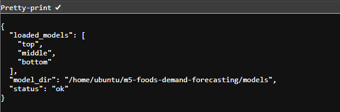

# M5 Forecasting Accuracy 分析

Kaggle の **M5 Forecasting Accuracy** データセットを用いて、FOODS カテゴリ商品の需要予測を行う機械学習プロジェクトです。

本プロジェクトでは、以下を実装しました。

* Notebook でのデータ分析・特徴量設計・モデル評価
* Python スクリプトによる Notebook の一括再実行
* 学習済みモデルの保存
* Flask API による予測処理
* HTML デモ画面からの予測実行
* AWS S3 への成果物保存
* AWS EC2 上での Flask API 起動

## プロジェクト概要

本プロジェクトでは、食品商品の過去販売数・価格・曜日・イベント・SNAP などの情報をもとに、将来の販売数を予測する回帰モデルを構築しました。

M5 データは、商品・店舗・日付ごとの販売数を持つ時系列データです。

食品カテゴリでは、販売量の大きい商品と販売機会の少ない商品で需要の性質が大きく異なります。そこで、実務のABC分析の考え方を参考に、商品を販売規模別の3層に分けて分析しました。

本プロジェクトの分類は、在庫金額や利益率まで含めた厳密なABC分類ではなく、**需要予測の難易度を比較するための販売数量ベースの層化サンプリング**です。

* `top`: 販売量が大きい商品（A相当）
* `middle`: 販売量が中程度の商品（B相当）
* `bottom`: 販売量が小さい商品（C相当、累計販売数0の商品は除外）

計算資源を考慮し、各層から30商品、合計90商品を抽出しています。各商品は10店舗分の系列を持つため、分析対象は合計900系列です。

商品選定には、最初のwalk-forward評価日である **2015-10-01より前の販売履歴だけ**を使用します。評価期間の販売実績を商品分類に使わないことで、商品選定を通じた未来情報の混入を防ぎます。分類後の対象商品は固定し、同じ商品集合で特徴量比較・モデル比較・walk-forward評価を行います。

各グループごとにモデルを学習・評価し、販売規模による予測難易度の違いを確認しました。

## プロジェクトのスコープ

本リポジトリは、以下の能力を示すためのポートフォリオです。

* 時系列データの前処理とEDA
* 未来情報を混入させない特徴量設計
* ベースライン、Ablation Study、目的関数・目的変数変換の比較
* 時系列ホールドアウトとwalk-forward評価
* 学習済みモデルの保存とFlask APIへの接続
* LinuxおよびAWS上での実行確認

本番運用を目的としたシステムではないため、コンテナ化、CI/CD、監視、特徴量ストア、自動再学習などは対象外としています。これらは実運用化する場合の追加要件として後述します。

## 使用技術

* Python
* pandas
* NumPy
* scikit-learn
* XGBoost
* Flask
* joblib
* Jupyter Notebook
* Linux / Bash
* Git / GitHub
* AWS S3
* AWS EC2

## プロジェクト構成

```text
m5-foods-demand-forecasting/
├── notebooks/
│   └── m5_foods_demand_forecasting.ipynb
├── src/
│   ├── run_pipeline.py
│   ├── item_grouping.py
│   ├── business_analysis.py
│   └── api.py
├── scripts/
│   ├── run_linux.sh
│   ├── run_business_analysis.sh
│   ├── run_api.sh
│   └── upload_results_to_s3.sh
├── results/
├── images/
├── models/
├── tests/
│   └── test_item_grouping.py
├── requirements.txt
├── .gitignore
└── README.md
```

## データソース

使用データは Kaggle の **M5 Forecasting Accuracy** データセットです。

主に以下のデータを使用しています。

| ファイル                         | 内容                         |
| ---------------------------- | -------------------------- |
| `sales_train_validation.csv` | 商品・店舗ごとの日次販売数              |
| `calendar.csv`               | 日付、曜日、イベント、SNAP などのカレンダー情報 |
| `sell_prices.csv`            | 商品・店舗・週ごとの販売価格             |

本プロジェクトでは、`sales_train_validation.csv` の FOODS カテゴリを対象に、2015-10-01より前の販売履歴で商品別累計販売数を計算し、`top` / `middle` / `bottom` の3層から各30商品を抽出しました。

## 処理の流れ

全体の処理は以下の流れです。

```text
1. Kaggle M5 データの読み込み
2. FOODS カテゴリ商品の抽出
3. 2015-10-01より前の履歴だけで商品別累計販売数を計算
4. ABC分析を参考に top / middle / bottom の3層から各30商品を抽出
5. 抽出した商品集合を固定
6. 横持ちの日次販売データを縦持ちデータへ変換
7. calendar / sell_prices と結合
8. lag / rolling / 価格 / イベント / SNAP 特徴量を作成
9. 2016-03-01を境に最終 train / test を時系列分割
10. XGBoost モデルを学習
11. 特徴量セットを変えながら Ablation Study
12. squarederror / log1p / Poisson を比較
13. walk-forward評価で時点による性能変動を確認
14. 最終モデルを joblib で保存
15. Flask API / HTMLデモからモデルを呼び出す
16. 成果物を S3 に保存し、EC2 上で API を起動
```

## 特徴量設計

需要予測では、過去の販売傾向・曜日・価格・イベントなどが重要になります。

本プロジェクトでは、以下の特徴量を作成しました。

### lag 特徴量

過去の同一商品の販売数を特徴量として使用します。

| 特徴量      | 意味       |
| -------- | -------- |
| `lag_7`  | 7日前の販売数  |
| `lag_14` | 14日前の販売数 |
| `lag_21` | 21日前の販売数 |
| `lag_28` | 28日前の販売数 |

食品販売には曜日周期や月次に近い周期があるため、1週間前・2週間前・4週間前の販売数を参照しています。

### rolling 特徴量

直近数日間の平均販売数を特徴量として使用します。

| 特徴量               | 意味           |
| ----------------- | ------------ |
| `rolling_mean_7`  | 直近7日間の平均販売数 |
| `rolling_mean_14` | 直近14日間の平均販売数 |
| `rolling_mean_28` | 直近28日間の平均販売数 |
| `rolling_std_7`   | 直近7日間の販売数の標準偏差 |
| `rolling_std_14`  | 直近14日間の販売数の標準偏差 |
| `rolling_std_28`  | 直近28日間の販売数の標準偏差 |

一日単位の販売数はブレが大きいため、移動平均を使うことで最近の売れ行きを安定して表現します。

rolling 特徴量では、予測対象日の販売数が混入しないように `shift(1)` を使っています。

```python
model_df["rolling_mean_7"] = model_df.groupby("id")["sales"].transform(
    lambda x: x.shift(1).rolling(7).mean()
)
```

これにより、予測時点より未来の情報を使わないようにしています。

### zero rate 特徴量

販売数が少ない商品では、「販売数が0だった日がどれくらいあるか」が重要になります。

| 特徴量                 | 意味                |
| ------------------- | ----------------- |
| `zero_rate_7`  | 過去7日間で販売数が0だった割合 |
| `zero_rate_14` | 過去14日間で販売数が0だった割合 |
| `zero_rate_28` | 過去28日間で販売数が0だった割合 |

特に `bottom` グループでは販売数が0の日が多いため、zero rate は販売規模の小さい商品の予測に使用しました。

### 曜日・カレンダー特徴量

| 特徴量                      | 意味          |
| ------------------------ | ----------- |
| `wday_1` ～ `wday_7`      | 曜日の one-hot |
| `month`                  | 月           |
| `year`                   | 年           |
| `week_of_month`          | 月内の週        |
| `is_weekend`             | 週末フラグ       |
| `has_event` / `is_event` | イベント日フラグ    |
| `snap`                   | SNAP対象日フラグ  |

食品需要は曜日やイベントの影響を受けるため、カレンダー情報を特徴量として追加しています。

### 価格特徴量

| 特徴量                | 意味         |
| ------------------ | ---------- |
| `sell_price`                   | 当日の販売価格 |
| `price_lag_1`                  | 1時点前の販売価格 |
| `price_diff_1`                 | 現在価格と1時点前価格の差 |
| `price_pct_change_1`           | 1時点前からの価格変化率 |
| `is_price_down` / `is_price_up` | 値下げ・値上げフラグ |
| `price_x_rolling_mean_7`       | 価格と直近需要の交互作用 |
| `price_down_x_rolling_mean_7`  | 値下げと直近需要の交互作用 |

価格の変動は需要に影響するため、単純な価格だけでなく、直前価格との差・変化率・値上げ／値下げフラグも特徴量として使用しました。

### カテゴリ・店舗特徴量

| 特徴量       | 意味   |
| --------- | ---- |
| `dept_*`  | 部門   |
| `store_*` | 店舗   |
| `state_*` | 州    |

商品や店舗によって販売傾向が異なるため、カテゴリ・部門・店舗・州を one-hot 化して特徴量に加えました。

## モデル選定

本プロジェクトでは、最終的なモデルとして **XGBoost Regressor** を使用しました。

### XGBoost を選んだ理由

需要予測には ARIMA や LSTM などの時系列モデルもありますが、本プロジェクトでは以下の理由から XGBoost を採用しました。

### 1. 特徴量エンジニアリングとの相性が良い

M5 データは、単一の時系列ではなく、商品・店舗・日付・価格・イベントなど複数の情報を持つテーブルデータです。

XGBoost は、lag / rolling / price / event / category などの特徴量を組み合わせた表形式データに強く、今回のような特徴量設計ベースの需要予測に適しています。

### 2. 非線形な関係を扱える

需要は、価格・曜日・イベント・過去販売数などが複雑に絡み合って決まります。

線形回帰では表現しにくい非線形な関係も、XGBoost であれば木構造によって扱いやすくなります。

### 3. 学習が比較的速く、再実行しやすい

LSTM などの深層学習モデルは、計算コストが高く、学習環境への依存も大きくなります。

XGBoost は比較的軽量に学習でき、Linux 環境や EC2 上での再実行・推論にも向いています。

### 4. 特徴量重要度を確認できる

XGBoost は feature importance を確認できるため、どの特徴量が予測に効いているかを確認しやすいです。

本プロジェクトでは、特徴量設計とモデル評価を行い、どの種類の特徴量を追加したときに性能が変化するかを確認しました。

## 比較した特徴量セット

本プロジェクトでは、特徴量を段階的に追加して性能を比較する **Ablation Study** を行いました。

| バージョン                 | 内容                                |
| --------------------- | --------------------------------- |
| `base_lag_rolling`     | カレンダー、lag、rolling、zero rate |
| `v2_trend`             | base に短期・長期差分などのトレンド特徴量を追加 |
| `v3_dow_effect`        | v2 に学習期間から算出した曜日効果と交互作用を追加 |
| `v4_price_event_dept`  | v3 に価格、イベント、SNAP、店舗・州・部門などを追加 |

<!-- FEATURE_SELECTION_RESULT_START -->
特徴量セットごとの比較結果から、各グループでMAEが最小となった構成は以下です。

| グループ | MAE最小の特徴量セット | 特徴量数 | MAE | RMSE | MAE ratio |
| --- | --- | --- | --- | --- | --- |
| bottom | v4_price_event_dept | 48 | 0.4898 | 0.7967 | 1.1795 |
| middle | v4_price_event_dept | 48 | 0.8523 | 1.2539 | 0.9235 |
| top | v4_price_event_dept | 48 | 5.2561 | 8.4724 | 0.3299 |
<!-- FEATURE_SELECTION_RESULT_END -->

## 最終モデルの選定基準

最終モデルは、`v4_price_event_dept` を使用した以下の3方式で比較しました。

* `XGBoost_squarederror_v4`: 販売数をそのまま回帰
* `XGBoost_log1p`: 販売数を `log1p` 変換して回帰し、予測後に元の尺度へ戻す
* `XGBoost_poisson`: カウントデータ向けのPoisson目的関数を使用

主指標は **MAE** としました。需要予測において「1日・1系列あたり平均で何個ずれるか」を直接解釈でき、需要規模別のモデル比較にも説明しやすいためです。グループ間の相対比較には `MAE ratio`、大きな誤差の確認にはRMSEを補助指標として使用しました。

<!-- MODEL_SELECTION_RESULT_START -->
3方式を同じホールドアウト期間で比較し、MAEを主指標として選定した結果です。

| グループ | MAE最小モデル | MAE | RMSE | MAE ratio |
| --- | --- | --- | --- | --- |
| bottom | XGBoost_log1p | 0.4583 | 0.8217 | 1.1037 |
| middle | XGBoost_log1p | 0.8087 | 1.2756 | 0.8763 |
| top | XGBoost_log1p | 5.1614 | 8.9268 | 0.3239 |
<!-- MODEL_SELECTION_RESULT_END -->

## 目的変数の log1p 変換

販売数データは、少数の商品が多く売れ、多くの商品は販売数が少ないという歪んだ分布を持ちます。

そのため、目的変数 `sales` に対して `log1p` 変換を適用しました。

```python
y_train_log = np.log1p(y_train)
```

予測後は `expm1` で元の販売数スケールに戻しています。

```python
preds = np.expm1(model.predict(X_test))
```

log1p 変換を使うことで、大きな販売数にモデルが引っ張られすぎることを抑え、小さい販売数の商品にも対応しやすくしました。

## 評価方法

時系列データであるため、ランダム分割ではなく、日付で train / test を分割しました。

```text
train: 2016-03-01 より前
test : 2016-03-01 以降
```

評価指標は以下を使用しました。

| 指標        | 意味                |
| --------- | ----------------- |
| MAE       | 予測誤差の絶対値平均        |
| RMSE      | 大きな誤差をより重く見る指標    |
| MAE ratio | 平均販売数に対する MAE の割合 |

販売規模が `top` / `middle` / `bottom` で大きく異なるため、単純な MAE だけでなく、平均販売数に対する誤差割合である MAE ratio も確認しました。

### Walk-forward評価

最終ホールドアウト1回だけに依存しないよう、以下の4時点でも学習期間を順次拡張して評価しました。

* 2015-10-01
* 2015-12-01
* 2016-02-01
* 2016-03-01

商品グループは最初の評価日である2015-10-01より前の情報だけで固定しているため、すべての評価時点で商品選定に未来の販売実績を使用しません。

## モデル評価結果

商品グループ選定ロジック修正後の評価結果を、再実行後にCSVから自動反映します。

<!-- FINAL_RESULTS_TABLE_START -->
| グループ | モデル | MAE | RMSE | 平均販売数 | MAE ratio |
| --- | --- | --- | --- | --- | --- |
| bottom | XGBoost_log1p | 0.4583 | 0.8217 | 0.4152 | 1.1037 |
| bottom | XGBoost_poisson | 0.4846 | 0.7998 | 0.4152 | 1.1671 |
| bottom | XGBoost_squarederror_v4 | 0.4898 | 0.7967 | 0.4152 | 1.1795 |
| middle | XGBoost_log1p | 0.8087 | 1.2756 | 0.9229 | 0.8763 |
| middle | XGBoost_poisson | 0.8482 | 1.2491 | 0.9229 | 0.9190 |
| middle | XGBoost_squarederror_v4 | 0.8523 | 1.2539 | 0.9229 | 0.9235 |
| top | XGBoost_log1p | 5.1614 | 8.9268 | 15.9342 | 0.3239 |
| top | XGBoost_poisson | 5.2405 | 8.4990 | 15.9342 | 0.3289 |
| top | XGBoost_squarederror_v4 | 5.2561 | 8.4724 | 15.9342 | 0.3299 |
<!-- FINAL_RESULTS_TABLE_END -->

### 結果の解釈

<!-- RESULT_INTERPRETATION_START -->
* `top`: MAE 5.1614、平均販売数に対するMAE ratioは 0.3239 でした。
* `middle`: MAE 0.8087、平均販売数に対するMAE ratioは 0.8763 でした。
* `bottom`: MAE 0.4583、平均販売数に対するMAE ratioは 1.1037 でした。
絶対誤差だけでなくMAE ratioも併用することで、販売規模が異なるグループ間の予測難易度を比較しています。
<!-- RESULT_INTERPRETATION_END -->

## Business Analysis

需要予測モデルを作成する前段階として、FOODSカテゴリ商品の販売傾向を確認しました。

具体的には、商品グループ別の売上推移、販売数が0だった日の割合、イベント日・SNAP対象日・価格帯ごとの平均販売数を分析しています。

### Sales Trend by Group

2015-10-01より前の累計販売数で固定した `top` / `middle` / `bottom` の対象商品について、全期間の日別販売数推移を確認しました。


### 販売数が0だった日の割合

商品グループごとに、販売数が0だった日の割合を確認しました。

`bottom` グループでは販売数が0の日が多く、販売数の予測が難しくなりやすい傾向があります。


### Event Impact

イベント日と通常日の平均販売数を比較しました。

イベント情報は食品需要に影響する可能性があるため、需要予測モデルの特徴量として使用しました。


### SNAP Impact

SNAP対象日と非対象日の平均販売数を比較しました。

SNAPは州ごとに対象日が異なるため、州ごとの販売データと組み合わせて確認しました。


### Price vs Sales

直近期間の販売データと価格データを結合し、価格帯ごとの平均販売数を確認しました。

価格は需要に影響する要素の一つであるため、需要予測モデルの特徴量として使用しました。


### 分析結果から確認したこと

* `top` グループの商品は販売数が大きく、比較的安定した需要がある
* `bottom` グループの商品は販売数が0の日が多く、予測が難しくなりやすい
* イベント日やSNAP対象日では、通常日と販売数の傾向が異なる可能性がある
* 価格帯によって平均販売数に違いが見られる
* 販売規模ごとに需要の特徴が異なるため、商品グループ別にモデルを作成した

この分析結果をもとに、販売規模別のモデル作成や、価格・イベント・SNAPなどの特徴量を使用する方針を整理しました。

## ソースコードの説明

### `notebooks/m5_foods_demand_forecasting.ipynb`

分析・検証用の Notebook です。

主に以下を行います。

* M5 データの読み込み
* FOODS カテゴリの抽出
* 販売規模別グループ作成
* EDA
* 特徴量作成
* モデル学習
* 評価
* 特徴量重要度の確認
* Ablation Study

### `src/run_pipeline.py`

分析Notebookをコマンドラインから一括実行するためのランナースクリプトです。独立したMLOps基盤や自動再学習パイプラインではなく、Notebookに記録した分析・学習処理をLinux上でも同じ順序で再実行することを目的としています。

主な役割は以下です。

* プロジェクトルートの解決
* `jupyter nbconvert` によるNotebookの実行
* 実行ログの表示
* エラー発生時の終了コード返却
* Linux 上での再実行

### `src/business_analysis.py`

FOODSカテゴリ商品の販売傾向を分析し、グラフ画像と集計CSVを出力するファイルです。

主に以下を行います。

* FOODSカテゴリ商品の抽出
* 2015-10-01より前の販売履歴による商品別 `top` / `middle` / `bottom` 分類と各30商品の抽出
* 商品グループ別の売上推移の可視化
* 販売数が0だった日の割合の集計
* イベント日と通常日の平均販売数比較
* SNAP対象日と非対象日の平均販売数比較
* 価格帯ごとの平均販売数比較

この分析では、モデル構築前に販売傾向を確認し、販売規模別にモデルを分けた理由や、イベント・SNAP・価格を特徴量に入れた理由を整理しています。

### `src/api.py`

Flask API と HTML デモ画面を提供するファイルです。

主なエンドポイントは以下です。

| エンドポイント                   | 内容            |
| ------------------------- | ------------- |
| `/`                       | HTML デモ画面     |
| `/health`                 | API の状態確認     |
| `/features/<sales_group>` | モデルが要求する特徴量一覧 |
| `/predict`                | 需要予測          |

API 起動時に `models/` フォルダから学習済みモデルを読み込みます。

予測時には、入力された特徴量をモデルの要求する特徴量に合わせ、不足している特徴量は 0 で補完します。

```text
画面から主要特徴量を入力
↓
API が JSON を受け取る
↓
モデルに必要な特徴量の形に変換
↓
不足特徴量を 0 で補完
↓
XGBoost モデルで予測
↓
log1p モデルの場合は expm1 で販売数に戻す
↓
JSON と HTML 画面に結果を返す
```

### Prediction Demo


食品需要予測のHTMLデモ画面です。

商品タイプ、過去の販売数、直近の売れ行き、価格、週末・イベント・SNAP条件を入力し、予測販売数を確認できます。

### Prediction Result


入力値をもとに、Flask APIが学習済みXGBoostモデルを呼び出し、予測販売数を返します。

画面上では「約〇個」のように表示し、技術者向けにはJSONレスポンスも確認できるようにしています。

### API Health Check



`/health` では、APIの起動状態と読み込まれているモデルを確認できます。

現在の HTML デモでは、ユーザーに分かりやすいように、機械学習上の特徴量名を日本語に置き換えています。

| 画面での表記      | 内部の特徴量名          |
| ----------- | ---------------- |
| 1週間前の販売数    | `lag_7`          |
| 2週間前の販売数    | `lag_14`         |
| 直近1週間の平均販売数 | `rolling_mean_7` |
| 販売価格        | `sell_price`     |
| 週末          | `is_weekend`     |
| SNAP対象日     | `snap`           |
| 祝日・イベント日    | `has_event`      |

### `scripts/run_business_analysis.sh`

Linux 上で Business Analysis を実行するためのシェルスクリプトです。

主な役割は以下です。

* プロジェクトルートへ移動
* 仮想環境の確認
* `src/business_analysis.py` の実行
* 分析結果CSVとグラフ画像の生成

### `scripts/run_linux.sh`

Linux 上でNotebook一括実行スクリプトを呼び出すためのシェルスクリプトです。

主な役割は以下です。

* プロジェクトルートへ移動
* 仮想環境の確認
* Python スクリプトの実行
* Linux 環境での再実行

### `scripts/run_api.sh`

Flask API を起動するためのシェルスクリプトです。

手動で以下を打つ代わりに、スクリプトとして API を起動できます。

```bash
source .venv/bin/activate
python src/api.py
```

### `scripts/upload_results_to_s3.sh`

結果ファイル・画像・モデルを AWS S3 にアップロードするためのスクリプトです。

アップロード対象は主に以下です。

* `results/`
* `images/`
* `models/`

モデルファイルは GitHub に含めず、S3 に保存する構成にしています。

## Flask API の使い方

### API 起動

```bash
cd ~/m5-foods-demand-forecasting
source .venv/bin/activate
python src/api.py
```

ブラウザで以下にアクセスします。

```text
http://127.0.0.1:5000/
```

Lubuntu など別PCからアクセスする場合は、Lubuntu の IP アドレスを使います。

```text
http://<LubuntuのIP>:5000/
```

EC2 で公開する場合は、EC2 の Public IPv4 を使います。

```text
http://<EC2のPublicIPv4>:5000/
```

### health check

```bash
curl http://127.0.0.1:5000/health
```

レスポンス例:

```json
{
  "status": "ok",
  "loaded_models": ["top", "middle", "bottom"],
  "model_dir": "/path/to/models"
}
```

### prediction

```bash
curl -X POST http://127.0.0.1:5000/predict \
  -H "Content-Type: application/json" \
  -d '{
    "sales_group": "top",
    "features": {
      "lag_7": 10,
      "lag_14": 9,
      "lag_21": 8,
      "lag_28": 11,
      "rolling_mean_7": 10.5,
      "rolling_mean_14": 9.8,
      "rolling_mean_28": 9.2,
      "sell_price": 3.5,
      "is_weekend": 1,
      "snap": 0,
      "has_event": 0,
      "dow_ratio_x_rolling_mean_7": 12.0
    }
  }'
```

レスポンス例:

```json
{
  "sales_group": "top",
  "model_variant": "xgboost_log1p",
  "predicted_sales": 11.255692481994629,
  "missing_feature_count": 72,
  "note": "Missing features were filled with 0. For production use, generate all features from the same feature pipeline."
}
```

## Linux での実行方法

### 1. リポジトリを clone

```bash
git clone https://github.com/okpurgis-sudo/m5-foods-demand-forecasting.git
cd m5-foods-demand-forecasting
```

### 2. 仮想環境を作成

```bash
python3 -m venv .venv
source .venv/bin/activate
```

### 3. ライブラリをインストール

```bash
pip install --upgrade pip
pip install -r requirements.txt
```

### 4. Notebookを一括実行

```bash
bash scripts/run_linux.sh
```

### 5. Business Analysis 実行

```bash
bash scripts/run_business_analysis.sh
```

### 6. Flask API 起動

```bash
source .venv/bin/activate
python src/api.py
```

ブラウザで以下にアクセスします。

```text
http://127.0.0.1:5000/
```

## AWS 連携

本プロジェクトでは、AWS S3 と EC2 を使用しました。

### S3 の役割

S3 は、学習済みモデルや評価結果を保存するために使用しています。

GitHub には大きなモデルファイルや生データを含めず、S3 に保存することで、コードと成果物を分離しています。

```text
GitHub: ソースコード管理
S3    : モデル・結果ファイル保存
EC2   : API 実行環境
```

### EC2 の役割

EC2 は、Flask API を外部からアクセスできる形で起動するために使用しています。

EC2 上では以下を行います。

```text
1. GitHub からコードを取得
2. S3 から学習済みモデルを取得
3. Python 仮想環境を作成
4. Flask API を起動
5. Public IPv4 + 5000番ポートでブラウザからアクセス
```

## GitHub に含めないもの

以下はセキュリティ・容量の観点から GitHub 管理対象外にしています。

* Kaggle API key
* AWS access key
* 学習済みモデルファイル
* 生データ CSV
* 実行時に生成される一部の中間ファイル

## 工夫した点

### 1. データリーク対策

時系列データであるため、ランダム分割ではなく日付で train / test を分けました。

また、rolling 特徴量には `shift(1)` を使用し、予測対象日の販売数が特徴量に混入しないようにしました。

### 2. ABC分析を参考にした販売規模別モデル

販売数が多い商品と少ない商品では、需要の安定性やゼロ販売日の割合が異なります。

そこで、2015-10-01より前の販売数量だけで `top` / `middle` / `bottom` を決め、各層から30商品を抽出しました。商品数を限定したのはローカルPCの計算資源内でAblation Studyとwalk-forward評価を繰り返せるようにするためです。全商品での競技精度ではなく、需要規模による予測難易度の比較を目的としています。

### 3. Ablation Study

特徴量を段階的に追加し、どの種類の特徴量が性能改善に寄与するかを確認しました。

価格・イベント・SNAP・部門情報を追加した特徴量セットまで比較し、各グループでMAEが最小となる構成を確認します。

### 4. log1p 変換

販売数の分布が歪んでいるため、目的変数を log1p 変換しました。

これにより、大きな販売数の商品に引っ張られすぎる影響を抑えられるかを、未変換モデルおよびPoisson目的関数と比較しました。

### 5. Notebook一括実行スクリプト

Notebookで記録した分析・学習処理を、コマンドラインから一括実行できるようにしました。

Linux環境では、`scripts/run_linux.sh` からNotebook全体を一括実行できます。

### 6. API / HTML デモ化

学習済みモデルを Flask API から呼び出せるようにしました。

また、HTML デモ画面を作成し、ブラウザから入力値を指定して予測結果を確認できるようにしました。

### 7. AWS 連携

S3 にモデルや結果を保存し、EC2 上で Flask API を起動しました。

## 現在の制限

現在の HTML デモでは、主要な特徴量のみを画面から入力しています。

モデルが要求する全特徴量のうち、画面に表示していない詳細特徴量は 0 で補完しています。

そのため、現在のデモは「API とモデルの連携を確認するための簡易デモ」です。

実務レベルに近づけるには、商品IDと日付を入力すると、API 側で必要な特徴量を自動生成する構成にする必要があります。

## 実運用化する場合の追加要件

以下は本ポートフォリオの評価対象外ですが、実際の業務システムとして運用する場合に必要となる項目です。

* 商品IDと予測日から学習時と同じ特徴量を自動生成する推論処理
* 複数日先予測と、予測時点ごとのlag / rolling特徴量更新
* 学習・推論処理のモジュール分割と設定ファイル化
* 入力検証、認証、監視、ログ管理
* Dockerなどによる実行環境の固定
* テストとCI/CD
* データ更新およびモデル再学習の自動化

今回は分析設計、時系列評価、モデル比較、API接続を優先し、上記の本番運用機能は実装範囲に含めていません。

## 使用したスキル・実装内容

本プロジェクトでは、以下の技術・処理を使用しました。

* Python / pandas / NumPy を用いたデータ加工・集計
* M5データからFOODSカテゴリ商品の抽出
* 評価開始前の販売履歴に基づく `top` / `middle` / `bottom` 分類と各30商品の層化抽出
* 販売傾向、販売数が0だった日の割合、イベント・SNAP・価格帯ごとの分析
* lag / rolling / zero rate / price / event / SNAP 特徴量の作成
* 時系列データを考慮した train / test 分割
* XGBoost を用いた回帰モデルの学習・評価
* Ablation Study による特徴量セットの比較
* log1p 目的変数変換によるモデル改善
* joblib による学習済みモデルの保存・読み込み
* Flask による予測APIの作成
* HTMLによる簡易デモ画面の作成
* BashスクリプトによるLinux実行環境の整備
* AWS S3への成果物保存
* AWS EC2上でのFlask API起動
* Git / GitHub によるソースコード管理

## まとめ

本プロジェクトでは、Kaggle M5 データを用いた FOODS カテゴリ商品の需要予測モデルを構築しました。

販売規模別に商品を分類し、lag / rolling / zero rate / price / event / SNAP などの特徴量を作成しました。

XGBoost による Ablation Studyと、squarederror・log1p変換・Poisson目的関数の比較を行いました。

また、販売傾向の分析、Notebook一括実行スクリプト、Flask API、HTMLデモ、AWS S3 / EC2連携を実装しました。
